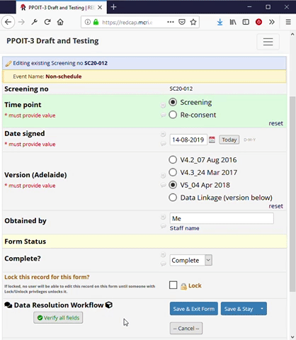
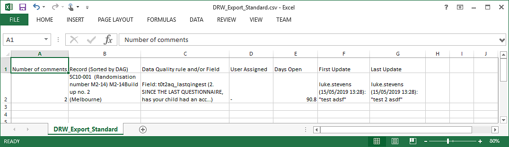
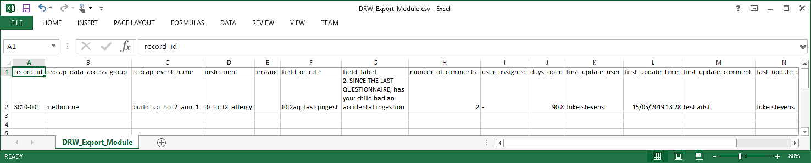

# REDCap External Module: DRW Tweaks

## Functionality
Provides some enhancements to REDCap's Data Resolution Workflow functionality, namely:
* Ability to change the user assigned to an issue via the table of issues on the Resolve Issues page.
* Adds a button to data entry forms that will do the "verified value" step for all fields not yet verified or queried.
* CSV exports have all data in separate columns (rather than combining, for example, username and comments). This tweak has no effect from REDCap v9.5.1 when the separation of data into distinct columns was implemented as a core feature.

## Screenshots
### Reassign User

### Verify All Fields

### CSV Exports (no effect after v9.5.1)
#### Standard CSV exports 
Columns contain multiple pieces of information:

#### Module CSV exports
Each piece of information in a separate column:

